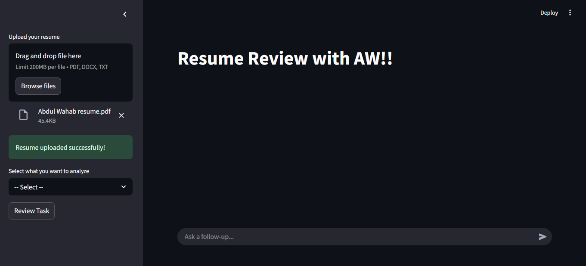
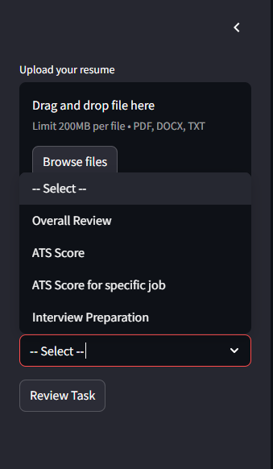
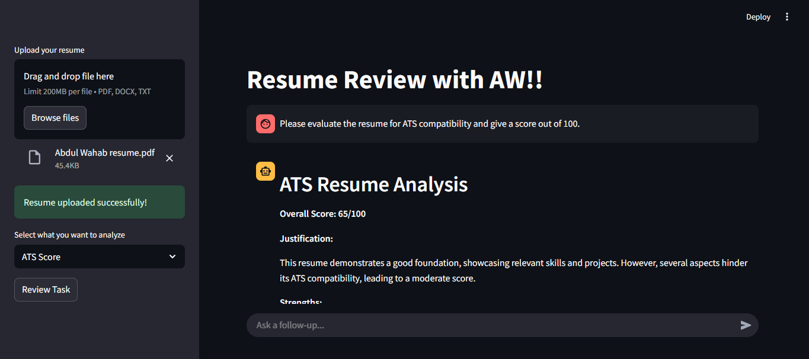
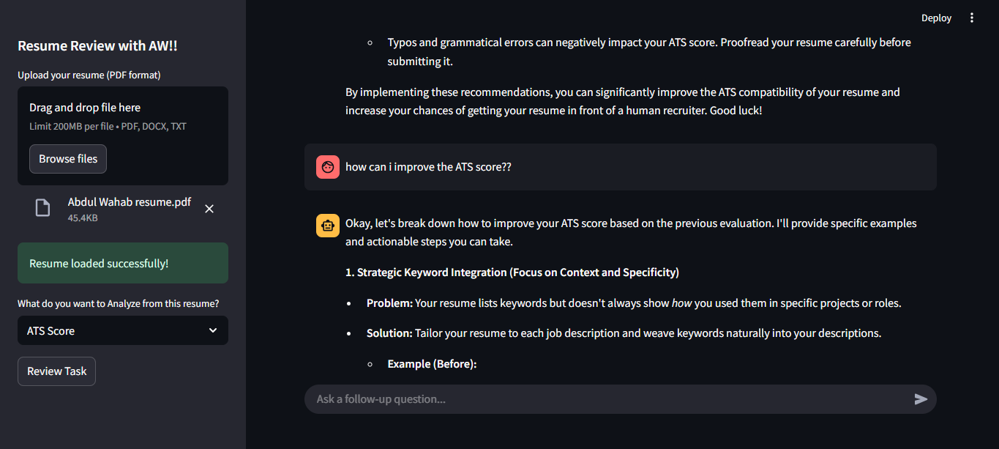
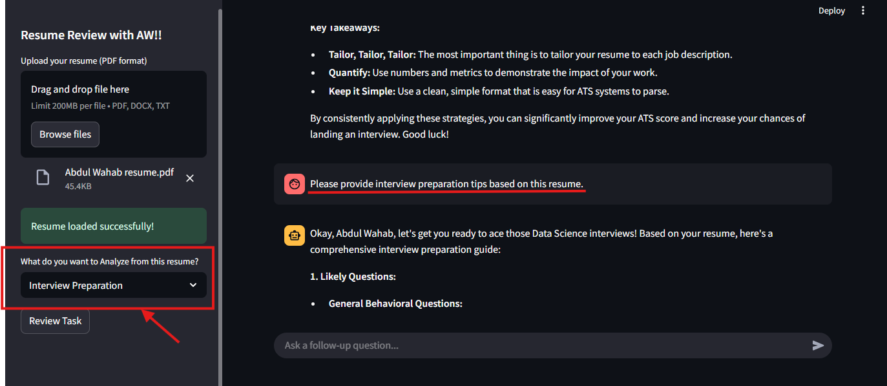
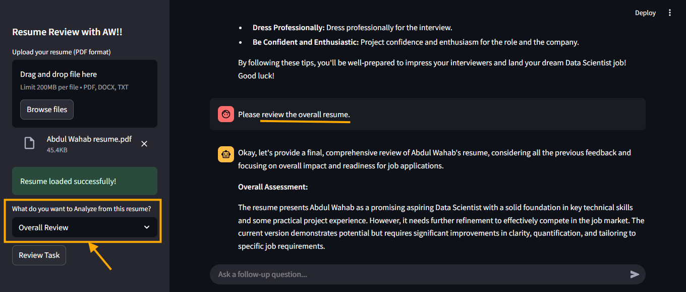
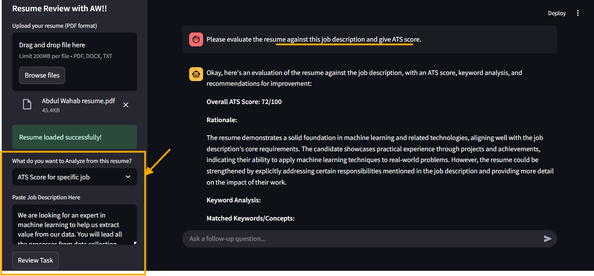

# 📄 AW Resume Analyzer and Interview Preperation

## Live Demo ( I am using free api key of Gemini Flash. So the App may not work but i am sharing some images of working demo )
https://aw-resume-analyzer-and-interview-prep.streamlit.app/



# Further Images are in the Bottom!!
An interactive web application built with **Streamlit**, **LangChain**, and **Gemini (Google Generative AI)** to intelligently analyze resumes and help job seekers improve their chances through ATS optimization, interview preparation, and expert resume reviews.

---

## 🚀 Features

- ✅ **Overall Resume Review**: Get detailed analysis highlighting strengths, weaknesses, and improvement suggestions.
- 📊 **ATS Score Evaluation**: Simulate an Applicant Tracking System to score your resume out of 100 based on industry standards.
- 🧠 **ATS Score for Specific Job**: Evaluate how well your resume aligns with a specific job description.
- 💬 **Interview Preparation**: Get tailored questions, tips, and insights based on your resume.
- 🔁 **Multi-mode Chat History**: Interact via follow-up questions in context with preserved mode-wise chat memory.

---

## 🧰 Tech Stack

| Tool              | Purpose                                   |
|-------------------|-------------------------------------------|
| Streamlit         | Web interface for uploading and chatting  |
| LangChain         | Handles prompt engineering and chaining   |
| Google Gemini API | LLM for reasoning and generating responses|
| Python            | Core programming language                 |

---

## 🛠️ Setup Instructions

### 1. Clone the Repository

```
git clone https://github.com/AbdulWahab740/resume-analyzer.git
cd resume-analyzer
```
### 2. Install Dependencies
Create a virtual environment (optional but recommended):

```
python -m venv venv
source venv/bin/activate  # On Windows: venv\Scripts\activate
```

Install required packages:

```
pip install -r requirements.txt
```
### 3. Set up Environment Variables
Create a .env file in the root directory:
```
GOOGLE_API_KEY=your_google_generative_ai_key
```
4. Run the App
```
streamlit run app.py
```

📥 Supported File Formats
.pdf
.docx
.txt








## Thank you so much for visiting this Repo.
